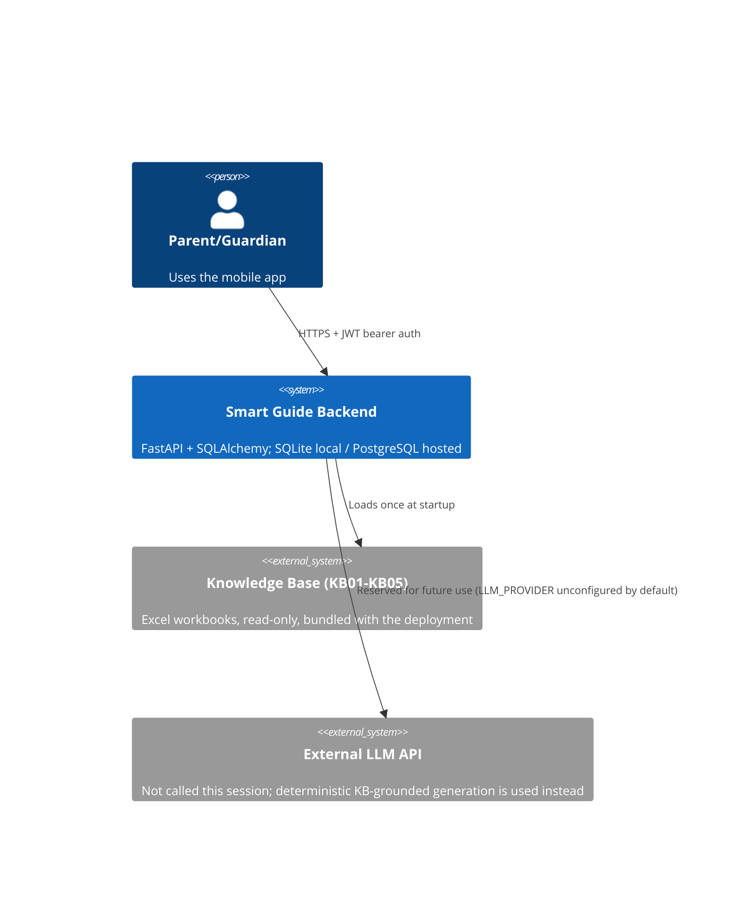
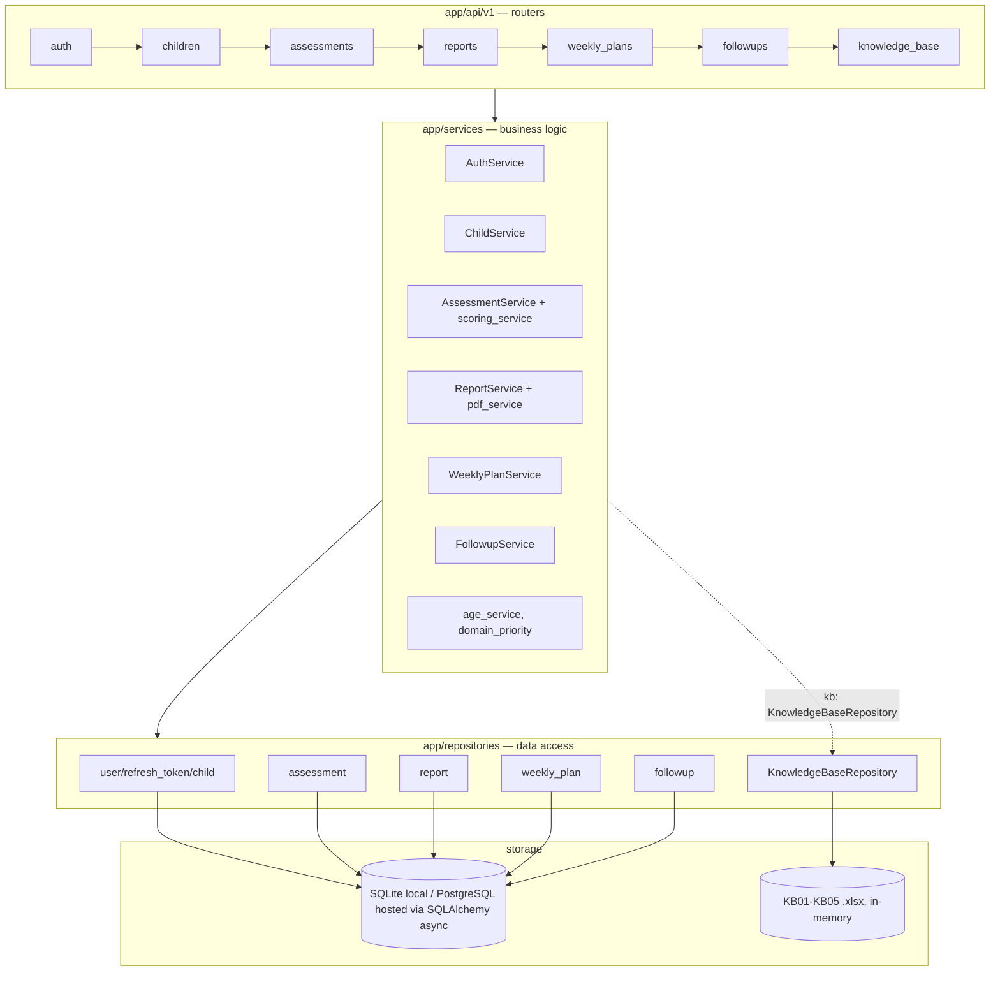
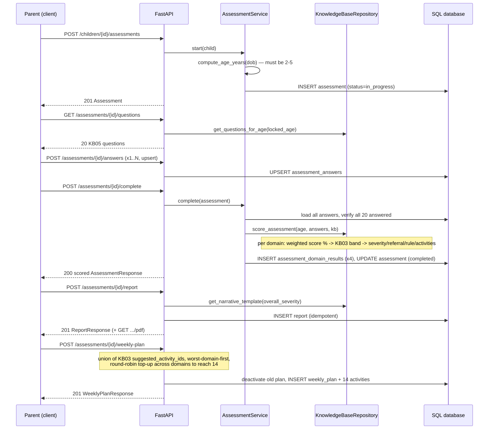
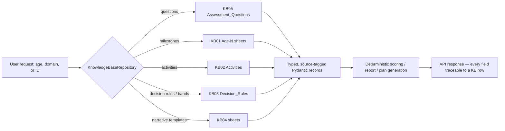
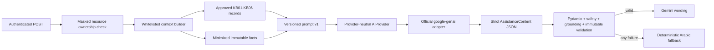
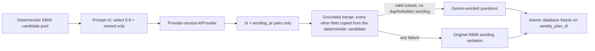
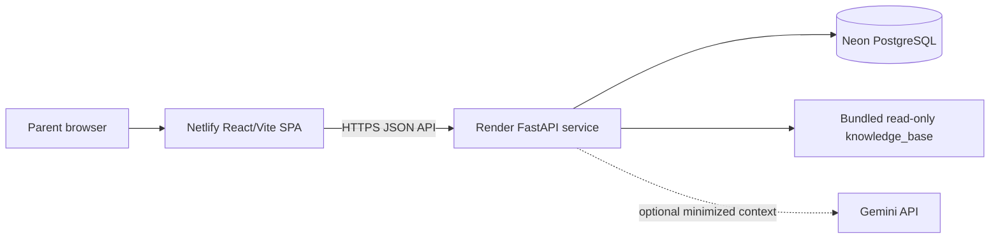

# Architecture

## Scope

This document describes the **backend** built this session. The Flutter mobile app is not yet
implemented (see `IMPLEMENTATION_STATUS.md`).

## System context

## Containers / layers

Cross-cutting: `app/core` (config, logging, database, errors, rate_limit, middleware,
constants), `app/security` (password hashing, JWT), `app/schemas` (Pydantic request/response
contracts), `app/rag` (KB loading/validation/normalization/parsing).

## Assessment → report → plan sequence

## RAG flow (retrieval, not generation)

There is no embedding-similarity search in this backend — "retrieval" is deterministic,
metadata-filtered lookup against the in-memory KB, which is small enough (≈591 rows total)
that indexed dict/list lookups by (age, domain, ID) are both correct and fast. See
`docs/RAG_AI_DESIGN.md` for the full pipeline and why this satisfies the "retrieve before
generate, never fabricate" requirement without needing a vector store.

## Request lifecycle (cross-cutting)

1. `RequestLoggingMiddleware` — structured log (method, path, status, duration; never body/PII).
2. CORS (if `CORS_ORIGINS` configured).
3. `slowapi` rate limiting on auth + compute-heavy endpoints (429 on breach).
4. Route handler → `Depends(get_current_user)` (JWT decode + active-user check) →
   ownership-checked service call.
5. Exception handlers (`app/core/errors.py`) convert `AppError` subclasses, Pydantic
   validation errors, and any unhandled exception into the consistent JSON envelope — stack
   traces never reach the client.

## Deterministic authority and optional assisted wording

Reports, scores, severity/referral decisions, weekly plans, and follow-up calculations remain
fully deterministic and KB-grounded. Milestone 2 adds a separate optional wording layer:

`app/ai` owns contracts, context minimization, prompts, providers, validation,
orchestration, and fallbacks. API routes never call Gemini directly. The default provider is
disabled; the real adapter is constructed only when `GEMINI_ENABLED`, `GEMINI_API_KEY`, and
`GEMINI_MODEL` are all configured. A fake provider is selectable only under
`APP_ENV=e2e`.

The React frontend calls only backend assistance endpoints and never receives a provider key, SDK, prompt, or raw response. Milestone 3 now persists the first validated follow-up question set on the weekly-plan row so hosted restarts do not change the wording.

## Milestone 3: structured AI operations and the 70% rule

Two more operations reuse this same pipeline shape but not `AssistanceContent` itself, since
their output (a list of worded questions; an explanation with steps/example/alternative)
doesn't fit the narrative title/summary/action_tips shape:

`app/ai/followup_questions.py` and `app/ai/activity_explanation.py` sit alongside
`orchestration.py` as sibling pipelines, sharing `AIProvider`/`ProviderRequest` (now carrying a
`response_schema` field so `providers/gemini.py` isn't hardcoded to one output shape),
provider selection, and structured/redacted logging — but each owns its own Pydantic schema,
validator, and deterministic-fallback builder, since letting Gemini choose *which* KB06/KB02
records to reference (rather than just wording) needs its own, narrower grounding contract.

The **70% reassessment eligibility** rule (`weekly_plan_service.py::is_reassessment_eligible`)
is plain deterministic business logic, not an AI concern — it replaces the previous strict-100%
gate in `FollowupService._validate_plan_ready` and is mirrored (for display only; the backend
remains authoritative) by a frontend util of the same name/shape.

Source-reference resolution (`app/ai/source_labels.py`) is a small, shared, pure function used
by both the narrative pipeline (`orchestration.py`) and the activity-explanation pipeline —
it reads only the `GroundingRecord`s already assembled for a request's context, never provider
output.

## Hosted beta topology

`netlify.toml` provides the SPA rewrite and security headers. `render.yaml` runs Alembic before the free web process starts and checks `/api/v1/health/ready`. The frontend backend-availability gate waits through a free Render cold start before mounting authentication. Hosted PostgreSQL URLs are normalized to `postgresql+asyncpg`, and frozen reassessment questions plus the resume signal survive restarts.
