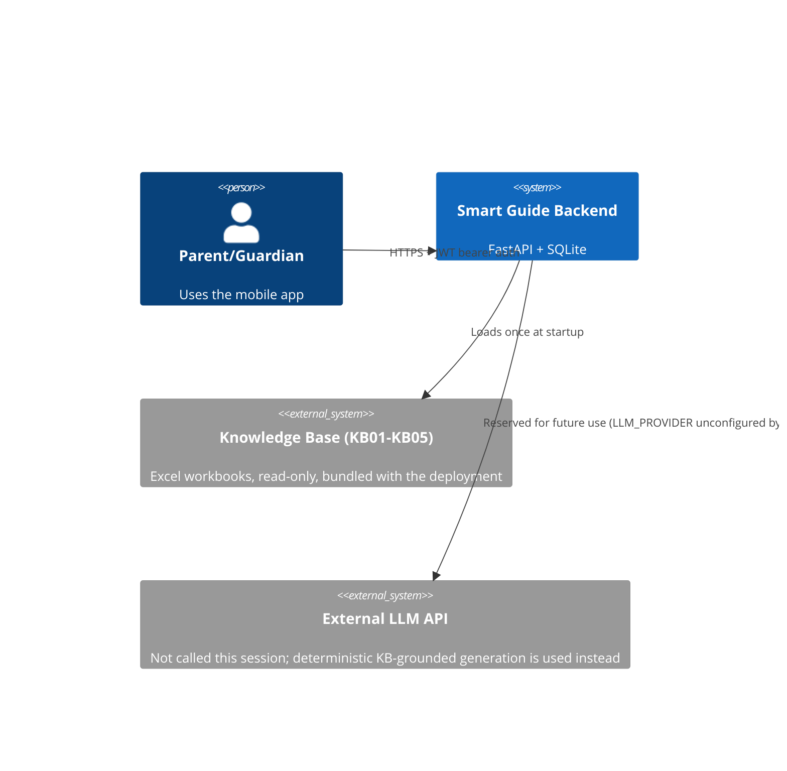
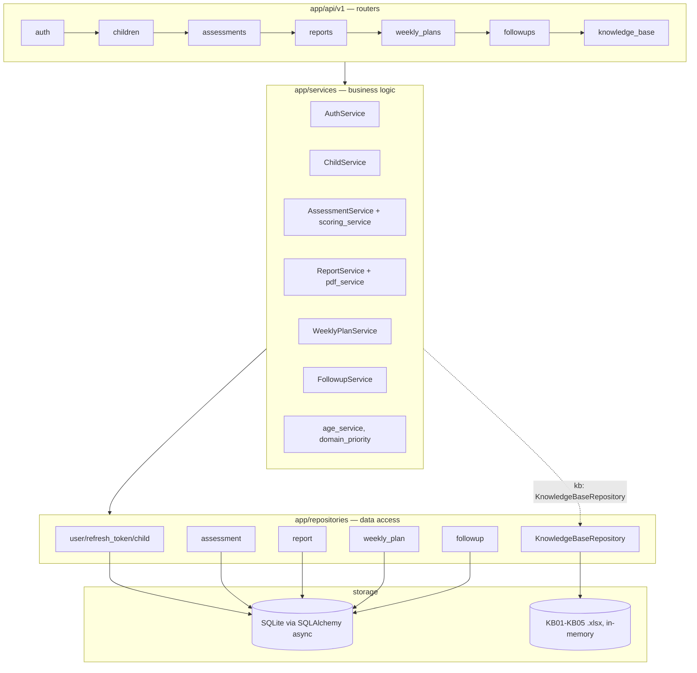
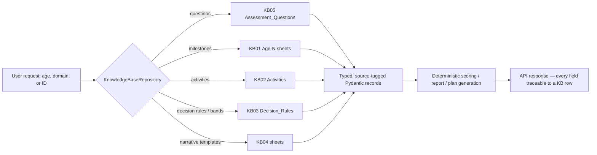

# Architecture

## Scope

This document describes the **backend** built this session. The Flutter mobile app is not yet
implemented (see `IMPLEMENTATION_STATUS.md`).

## System context

## Containers / layers

Cross-cutting: `app/core` (config, logging, database, errors, rate_limit, middleware,
constants), `app/security` (password hashing, JWT), `app/schemas` (Pydantic request/response
contracts), `app/rag` (KB loading/validation/normalization/parsing).

## Assessment → report → plan sequence

## RAG flow (retrieval, not generation)

There is no embedding-similarity search in this backend — "retrieval" is deterministic,
metadata-filtered lookup against the in-memory KB, which is small enough (≈591 rows total)
that indexed dict/list lookups by (age, domain, ID) are both correct and fast. See
`docs/RAG_AI_DESIGN.md` for the full pipeline and why this satisfies the "retrieve before
generate, never fabricate" requirement without needing a vector store.

## Request lifecycle (cross-cutting)

1. `RequestLoggingMiddleware` — structured log (method, path, status, duration; never body/PII).
2. CORS (if `CORS_ORIGINS` configured).
3. `slowapi` rate limiting on auth + compute-heavy endpoints (429 on breach).
4. Route handler → `Depends(get_current_user)` (JWT decode + active-user check) →
   ownership-checked service call.
5. Exception handlers (`app/core/errors.py`) convert `AppError` subclasses, Pydantic
   validation errors, and any unhandled exception into the consistent JSON envelope — stack
   traces never reach the client.

## Why deterministic generation, not an LLM call

No LLM provider is configured by default (`Settings.llm_configured` is `False` unless
`LLM_PROVIDER`/`LLM_API_KEY` are set to real values). Every report, weekly-plan, and
follow-up sentence in this session's implementation is either a verbatim KB03/KB04 text
snapshot or a simple Arabic sentence template filled with KB fields (domain name,
recommendation text) — never freely generated. This satisfies "if retrieval fails / no
provider configured, use a real deterministic fallback — never fabricate" without needing an
API key to be a fully functional product.
