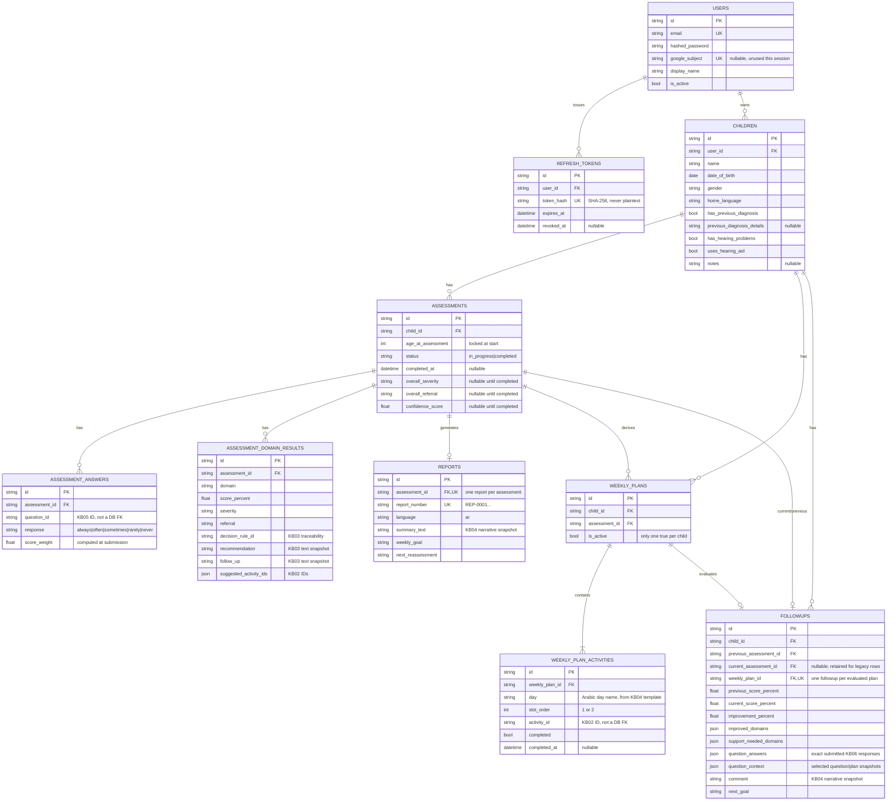

# Database Schema

SQLite for MVP (`DATABASE_URL`), via SQLAlchemy 2.x async ORM + Alembic migrations
(`backend/alembic/versions/`). All primary keys are UUIDv4 strings. All tables have
`created_at`/`updated_at` (UTC, timezone-aware — see `UTCDateTime` in
`docs/DECISIONS_AND_ASSUMPTIONS.md`). Foreign keys use `ON DELETE CASCADE`, and SQLite's
`PRAGMA foreign_keys=ON` is enabled on every connection so cascades actually fire (off by
default in SQLite otherwise).

The knowledge base (KB01–KB06) is **not** stored in the database — KB01–KB05 are loaded once
from their `.xlsx` files and KB06 from structured JSON into an in-memory, indexed
`KnowledgeBaseRepository`
(`app/repositories/knowledge_base_repository.py`) and queried by ID/age/domain. Assessment
answers and domain results store only the KB *IDs* they resolved to (e.g. `decision_rule_id`,
`activity_id`), not copies of KB content — except where noted below, where a text snapshot is
intentionally taken for audit stability.

## ERD

## Why some KB text is snapshotted and some is looked up live

`AssessmentDomainResult.recommendation`/`follow_up`, `Report.summary_text`, and
`Followup.comment`/`question_context` store generated or selected text **as it was at
generation time**, rather than
being re-derived from the live KB on every read. This is deliberate: if the knowledge base is
ever corrected or updated, a parent's historical report must not silently change — it's an
audit record of what they were actually told. By contrast, `strengths`/`support_needs` (skill
names) and resolved `ActivityRecord`/`MilestoneRecord` details are looked up live against the
KB by ID on every read, since they're presentation labels rather than scored decisions, and
KB01/KB02 content is expected to stay stable (read-only per `CLAUDE.md`).

## Retention

Per `PROJECT_SPEC.md`: assessments, reports, and follow-ups are **never deleted** except via
cascading child/account deletion (an explicit, user-initiated action). Weekly plans are the
one exception — old plans are soft-deactivated (`is_active=False`) rather than deleted, so
"only the latest is active" (per `CLAUDE.md`) while still preserving history for audit.

## Migrations

Run from `backend/`: `alembic upgrade head`. Each phase of this session added one migration
(`backend/alembic/versions/`): users+refresh_tokens → children → assessments (3 tables) →
reports → weekly_plans (2 tables) → followups → plan-linked follow-up context. All verified
to apply cleanly against a fresh database (see `IMPLEMENTATION_STATUS.md`).
